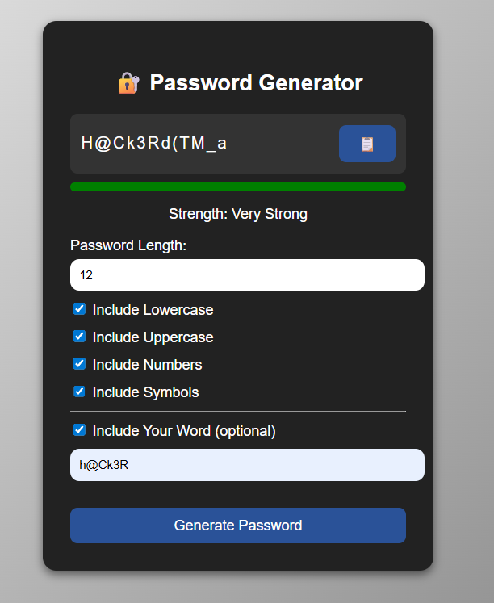

# 🔐 Password Generator
A secure, privacy-focused password generator built using **HTML, CSS, and JavaScript**.  
This tool generates strong passwords locally in your browser — no data is stored or transmitted.

---
## Live Demo

Check out the live version of this Password Generator project here:  
[Password Generator](https://password-generator-git-main-vishals-projects-575d8d25.vercel.app?_vercel_share=3HAUbVIi7n1MKjjKKtD6pmljHOL7tJa4)

## 🚀 Features
- Strong random password generation
- Uppercase, lowercase, numbers, symbols support
- Works completely offline
- Clean and simple UI
- Open-source and customizable

---

## 🛡️ Security & Privacy
✔ Runs entirely on client-side  
✔ No data is stored  
✔ No data is transmitted  
✔ Fully open-source and auditable  

This makes the tool safe to use for generating passwords.

---

## 📥 How to Use
1. Clone or download this repository
2. Open `index.html` in any browser
3. Generate secure passwords instantly

---

## 🧩 Technologies Used
- HTML5  
- CSS3  
- JavaScript  

---

## 👨‍💻 Author
**Vishal Kumar**  
Cybersecurity Student | SOC Analyst Aspirant  

---

## ⭐ Support
If you like this project, give it a ⭐ on GitHub!

## 📸 Preview

